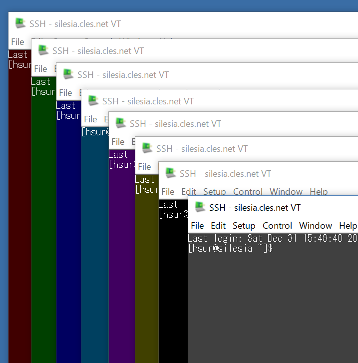

# TTXCommandLineOptKai

フォーラムでの「[マクロでの文字色と背景色の変更](https://ja.osdn.net/projects/ttssh2/forums/5841/21746/ "マクロでの文字色と背景色の変更")」の議論を参考に、[TTXCommandLineOpt](https://ja.osdn.net/projects/ttssh2/scm/svn/tree/head/tags/teraterm-4_86/TTXSamples/TTXCommandLineOpt/ "TTXCommandLineOpt") のコードをベースとして、太字や点滅の背景色も同時に変更されるように改良したものです。

ビルド環境を持っていない人のために、ビルド済みの dll で配布します。

## 使用方法

ttermpro.exe と同じフォルダに TTXCommandLineOptKai.dll をコピーするだけです。

ホストの指定で `192.168.0.1 /FG=0,255,0 /BG=0,0,0` のように指定することで文字色、背景色をホストごとに指定することができます。
RGB 指定をする人が面倒な場合には、**R**ed, **G**reen, **B**lue, **C**yan, **M**agenta, **Y**ellow, blac**K**, **S**ilver の8色をプリセットカラーとして定義してありますので、 `192.168.0.1 /BG=R` のように指定することもできます。

